# 基于云计算平台的联邦学习部署和研究

作者：steve_wang@sjtu.edu.cn

日期：2022.01.13

## 1. 项目介绍

在本项目中，我们将参考[这篇论文](https://arxiv.org/pdf/1602.05629.pdf)，根据其中的`Algorithm 1` 来实现`FedAvg`算法。我们使用[Conda](https://www.anaconda.com/products/individual)环境中的Python + [PyTorch](https://pytorch.org/)进行编程，并在[上海交通大学云计算平台](https://home.jcloud.sjtu.edu.cn/)部署模型进行训练。 我们选择基于PyTorch实现的MNIST手写数字辨识任务，使用`FedAvg`算法来实现在多个客户端的联邦学习。

在本项目中，我们手动实现非独立同分布（Non-IID）的MNIST数据集，并探索不同数量的客户机对算法准确率的影响。我们的模型部署在上海交通大学云计算平台上，所有的模型训练和参数更新都是基于CPU的。在初步的实验中，我们使用循环算法来实现多客户机的训练，在后续的实验中，我们使用Python的多进程模块来进一步实现客户机的并行计算。

---

本实验的计算资源为：

- 上海交通大学云计算平台

    - A服务器* 1：
        - `OS`: Ubuntu 20.04 LTS
        - `Memory`: 128GB
        - `Processor`: Intel Xeon Processor @ 2.4GHz * 64
        - `Disk Capacity`: 500GB
        - `GPU`: None

    - B服务器* 4：
        - `OS`: Ubuntu 20.04 LTS
        - `Memory`: 64GB
        - `Processor`: Intel Xeon Processor @ 2.4GHz * 32
        - `Disk Capacity`: 500GB
        - `GPU`: None

- 实验环境：
    - `Anaconda3-2021.11-Linux-x86_64`
    - `Python 3.8.12`
    - `PyTorch 1.10.1`

> 本项目部分代码参考[开源代码](https://github.com/WHDY/FedAvg) 

---

## 2. 循环式联邦学习系统

在本实验中，我们将通过循环来模拟`FedAvg`算法。服务器端和客户端分别写在`server.py` 和`client.py` 文件中。

本实验部署在上海交通大学云计算平台A服务器。

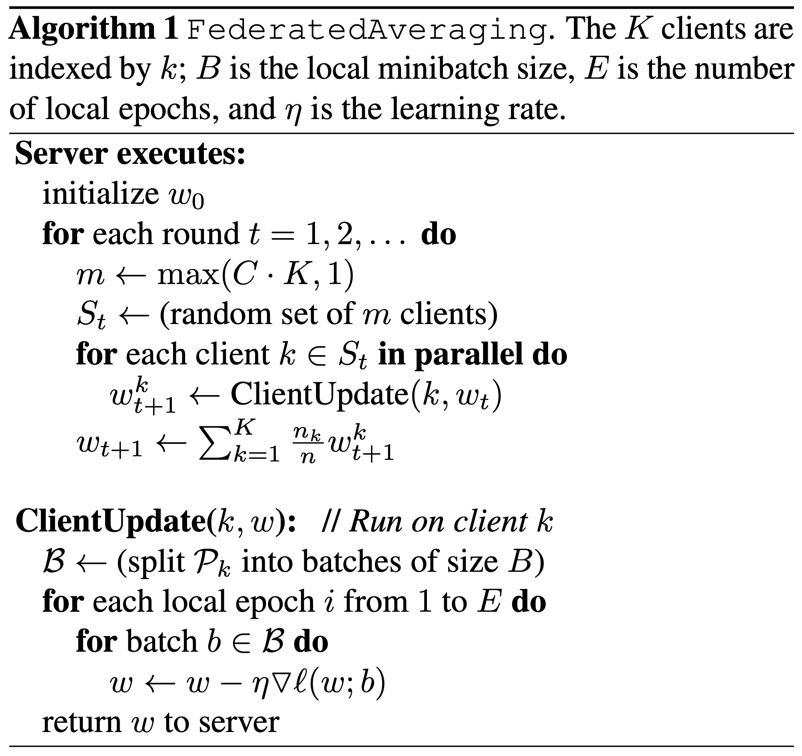

根据上图算法，我们可以写出如下的伪代码：

```python
# Creae Server and Clients
server = Server(...)
client_datasets = [Dataset[id, ...] for id in range(N_CLIENTS)]
client_group = [Client(id, ...) for id in range(N_CLIENTS)]

server.init(...) # Initialize Server
for comm_idx in range(N_COMM): # Communication loop
    # Reset the temp parameters to gather in each communication round
    temp_parameters = []
    for id in range(N_CLIENTS): # Client loop
        # Let client paramter equals to server parameter
        clients[id].parameters = server.parameters
        # Each client train its parameter with local data
        clients[id].train_with(client_datasets[id], ...)
        # Collects new parameter from clients
        temp_parameters.append(clients[id].parameters)
    # Optimize server parameters based on collected parameters if possible
    server.parameters = optimize(temp_parameters)
    # Evaluate the performance at the end of each communucation round
    server.test(test_data, test_label)
```

### 2.1 搭建服务器

在`server.py` 中，我们设置了客户机群的大小`nc`、每轮通讯的活跃客户机比例`cf`、总的通讯轮数`ncomm` 以及训练数据是否IID`iid`.

一些关键参数如下：

```python
# Some KEY arguments
parser.add_argument('-nc', '--num_of_clients', type=int, default=1000, help='numer of the clients')
parser.add_argument('-cf', '--cfraction', type=float, default=0.1, help='C fraction, 0 means 1 client, 1 means total clients')
parser.add_argument('-mn', '--model_name', type=str, default='mnist_cnn', help='the model to train')
parser.add_argument('-ncomm', '--num_comm', type=int, default=1000, help='number of communications')
parser.add_argument('-iid', '--IID', type=bool, default=False, help='the way to allocate data to clients')
```

- 具体代码细节请参考`server.py`

### 2.2 搭建客户机

在`client.py` 中，我们定义了单个客户端对象`SingleClient`和客户机群对象`ClientGroup`，客户机群储存所有客户机对象，每轮通讯收到激活的客户机名称，激活相应客户机并分配相应的训练数据集。

```python
class SingleClient(object):
    def __init__(self, train_dataset, device, name):
	# ...
    
    def local_update(self, epoch, batch_size, model, loss_fct, optimizer, global_params):
	# ...
      
class ClientGroup(object):
    def __init__(self, dataset_name, batch_size, is_iid, n_clients, device):
	# ...
    def dataset_allocator(self):
	# ...

```

- 具体代码细节请参考`client.py`

### 2.3 非独立同分布（Non IID）数据集

在`data_utils.py`中，我们定义了一个获取数据的对象`get_dataset` ，我们可以通过参数`isIID`来控制产生的数据集是否独立同分布（IID）。在本实验中，我们使用MNIST数据集有60000个训练样本。以100个客户机为例，IID数据集是将数据集打乱，每个客户机分配600个训练样本，Non IID是先根据标签对数据集进行排序，然后将其划分为200组大小为300的数据切片，然后分给每个客户机2组切片作为训练样本。

```python
class get_dataset(object):
    def __init__(self, dataSetName, isIID):
	# ...
    # mnistDataSetConstruct 数据重构
    def mnistDataSetConstruct(self, isIID):
	# ...
```

- 具体代码细节请参考`data_utils.py`

### 2.4 深度学习模型

在`models.py`中，我们创建了两个模型`mnist_cnn`和`mnist_2nn`，前者是一个有两个卷积层的卷积神经网络（CNN），后者是一个两层的全联接神经网络（FCN），我们将在后续的实验中对比两个模型在联邦学习背景下的学习效果。

```python
class Mnist_2NN(nn.Module):
    def __init__(self):
        super().__init__()
        self.fc1 = nn.Linear(784, 200)
        self.fc2 = nn.Linear(200, 200)
        self.fc3 = nn.Linear(200, 10)

    def forward(self, inputs):
        x = F.relu(self.fc1(inputs))
        x = F.relu(self.fc2(x))
        x = self.fc3(x)
        return x


class Mnist_CNN(nn.Module):
    def __init__(self):
        super().__init__()
        self.conv1 = nn.Conv2d(in_channels=1, out_channels=32, kernel_size=5, stride=1, padding=2)
        self.pool1 = nn.MaxPool2d(kernel_size=2, stride=2, padding=0)
        self.conv2 = nn.Conv2d(in_channels=32, out_channels=64, kernel_size=5, stride=1, padding=2)
        self.pool2 = nn.MaxPool2d(kernel_size=2, stride=2, padding=0)
        self.fc1 = nn.Linear(7*7*64, 512)
        self.fc2 = nn.Linear(512, 10)

    def forward(self, inputs):
        x = inputs.view(-1, 1, 28, 28)
        x = F.relu(self.conv1(x))
        x = self.pool1(x)
        x = F.relu(self.conv2(x))
        x = self.pool2(x)
        x = x.view(-1, 7*7*64)
        x = F.relu(self.fc1(x))
        x = self.fc2(x)
        return x
```

### 2.5 部署循环式联邦学习

- 我们在上海交通大学云计算平台A服务器部署模型，运行`server.py`

```bash
(py38) ➜  fed_avg python server.py
```

- 下图所示的实验中，客户机总数为100，更新比例`cf=0.1`，可以观察到前两轮通讯结果：每次活跃的10个客户机各不相同。

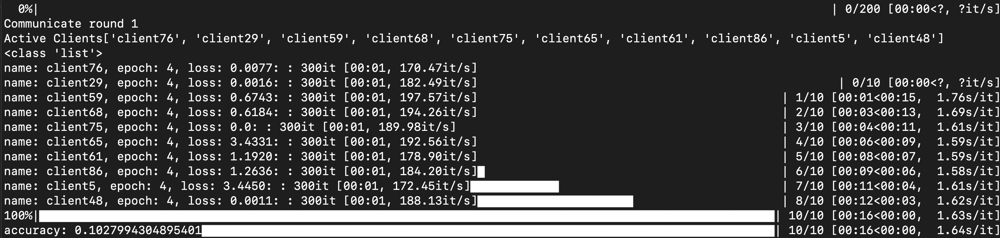

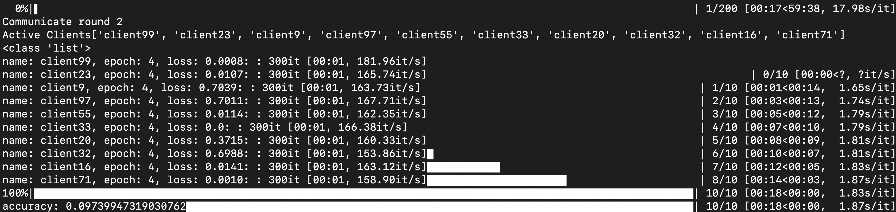

- 我们观察一下云计算服务器的资源占用情况，我们确认只有一个进程在循环运算

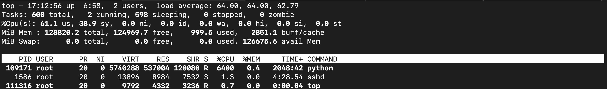

## 3. 并行式联邦学习系统

在本实验中，我们将通过Python多进程模块来并行化实现`FedAvg` 算法。服务器和客户机的代码分别在`server_para.py`和`client_para.py`中。

本实验部署在上海交通大学云计算平台四台B服务器。

### 3.1 服务器端并行式实现

在客户机中，我们取消了每个客户机展示当前训练状态的设置，其他部分和循环式客户机保持一致。在服务器端，我们使用Python多进程模块中的进程池来利用多进程来实现多客户机的并行式联邦学习训练，相应的伪代码如下：

```python
from multiprocessing import Pool

# Creae Server and Clients
server = Server(...)
client_datasets = [Dataset[id, ...] for id in range(N_CLIENTS)]
client_group = [Client(id, ...) for id in range(N_CLIENTS)]

server.init(...) # Initialize Server
    for comm_idx in range(N_COMM): # Communication loop
        # Reset the temp parameters to gather in each communication round
    	temp_parameters = []
        # Initialize multiprocessing pool
        with Pool(n_workers) as pool: 
            # Reset the process list to gather in each communication round
            process_list = []
            for id in range(N_CLIENTS): # Client loop
                # Let client paramter equals to server parameter
                clients[id].parameters = server.parameters
                # Each client train its parameter with local data in the pool
                process = pool.apply_async(clients[id].train_with(client_datasets[id], ...))
                # Gather all processes for their outputs
                process_list.append(process)
            # Close the pool
            pool.close()
            # Wait for all processes to complete 
            pool.join() 
            for process in process_list:
                # Get the client output in each process
                client_output = process.get()
                # Collects new parameters from clients
                temp_parameters.append(client_output.parameters)
            # Terminate the pool
            pool.terminate()
        # Optimize server parameters based on collected parameters if possible
        server.parameters = optimize(temp_parameters)
        # Evaluate the performance at the end of each communucation round
        server.test(test_data, test_label)
```

### 3.2 部署并行式联邦学习

- 我们在上海交通大学云计算平台B服务器部署并行式联邦学习，使用32个CPU、100个客户机、50轮通讯

```bash
(py38) ➜  fed_avg python server.py -cpu 32 -nc 100 -ncomm 50
```

- 并行式联邦学习训练时的效果如下，在下图的实验中，我们选择100台客户机，更新比例`cf=0.1` ，也就是同时有10台客户机在并行计算，以下为前两轮通讯效果

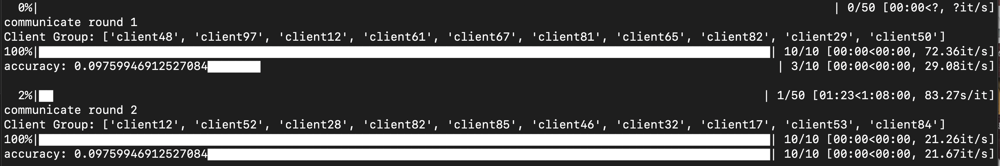

- 此时我们观察到并行式联邦学习的速度（`83s/epoch`）远远低于循环式联邦学习（`17s/epoch`）。需要说明的是，并行式联邦学习是在一台32核的交大云服务器上进行的，两次实验的配置仅CPU核数不同，但是时间相差四倍，可能是并行化计算框架还需要进行优化。
- 我们再观察一下云计算服务器的资源占用情况，我们确认有10个进程在并行运算。

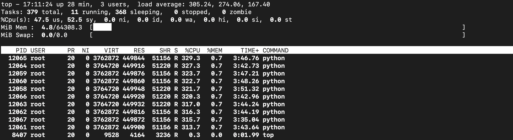

## 4. 实验设置和结果

在本章节的实验中：

- 如果没有特殊说明，我们使用的都是CNN模型。
- 如果没有特殊说明，我们使用的训练数据都是Non-IID的。
- 如果没有特殊说明，我们使用的都是循环式联邦学习。

### 4.1 联邦学习参与率研究

在本实验中，我们固定客户机的数量为100，我们研究每轮通讯中激活的客户机的比例`cf`（论文中的参数$C$）对联邦学习的影响。

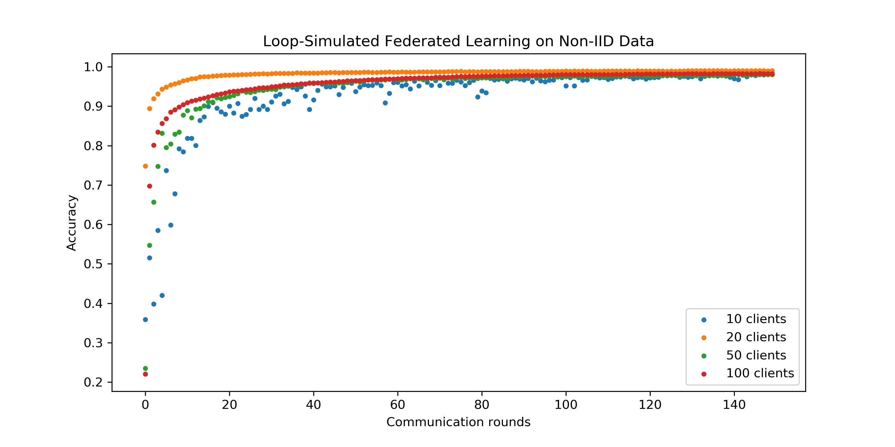

- 如上图，在我们的实验中，我们观察到对于Non-IID数据：
    - 参与更新的客户机比例过高和过低都会导致模型收敛变慢，最佳比例系数是$C=0.2$，这和论文中的结论不一致，论文中的最佳参数$C=0.1$在我们实验中表现最差；
    - 无论$C$值大小，模型最终收敛到几乎相同的准确率，$C$值只是影响模型收敛速度，并不影响模型收敛结果。

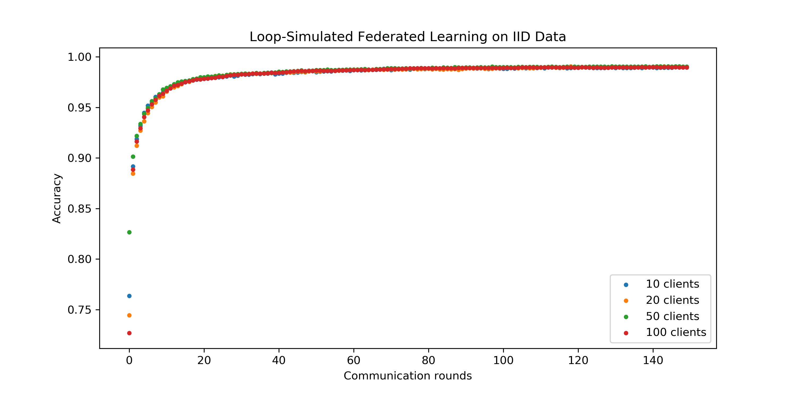

- 如上图，在我们的实验中，我们观察到对于IID数据：
    - 参与更新的客户机比例并不影响模型收敛速度和收敛性；
    - IID数据上模型收敛速度快于Non-IID数据。

### 4.2 联邦学习规模研究

在本实验中，我们控制客户机更新比例系数$C=0.1$不变，我们改变每次参与联邦学习的客户机总数，来研究联邦学习规模对模型准确率的影响。在训练过程中，我们保持模型的学习率为`lr=0.01`.

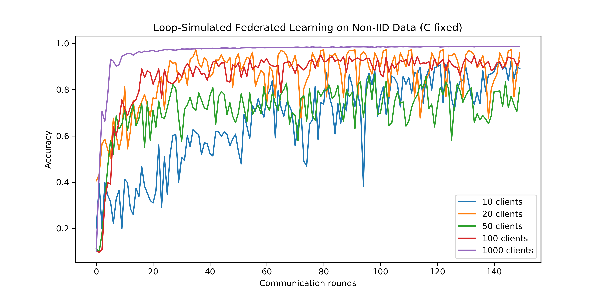

- 本实验中我们有如下思考：
    - 我们发现，**随着联邦学习规模的不断增大，模型收敛的速度更快，收敛也更加平滑和稳定**。在真实的世界中，用户数远多于1000，当然模型也会更加复杂，因此优化联邦学习一般有两个方向：增加联邦学习规模、简化模型
    - 尽管20个客户端的时候模型收敛的准确率接近于100个客户端的准确率，但是准确率波动较大，在一定程度上很难被认为收敛。
    - **我们认为这可能是因为我们设置的学习率过大，当每次参与更新的客户机数量比较少的时候，应该适当调小学习率。**

### 4.3 联邦学习中的学习率

本实验中，我们来设计一个简单的实验初步验证上一部分我们的猜想：当每次参与更新的客户机数量比较少的时候，应该适当调小学习率。

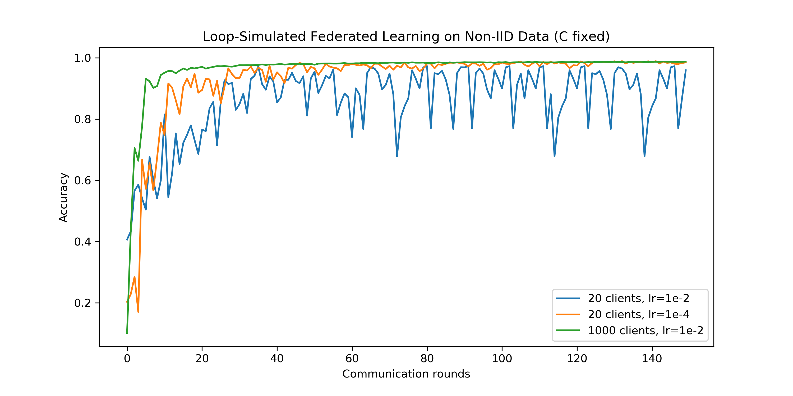

- 我们发现，**调小学习率之后的20个客户端的模型收敛更加平稳，并且最终收敛于1000个客户端的准确率**。
- 由于时间有限，上图结果只能**初步验证**我们的猜想，我们仍需进行多组实验才能进一步验证。

### 4.4 不同模型的联邦学习

在本实验中，我们对比了两种不同的神经网络模型的联邦学习过程。我们对比的模型分别是一个双层的全联接网络（FCN）和上面一直在用的双层卷积神经网络（CNN）。

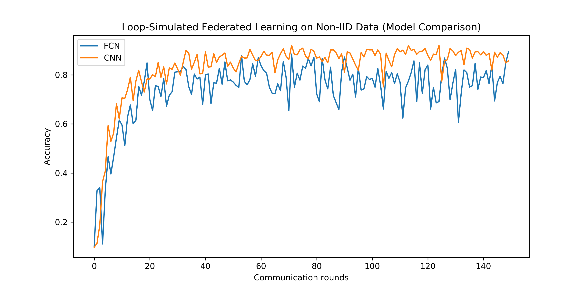

- 如上图所示，我们发现虽然FCN比CNN模型简单，但是两个模型收敛速度大致相同，FCN的准确率波动较大，CNN的准确率收敛相对来说比较稳定。
- FCN的准确率收敛值略低于CNN的准确率收敛值，我们认为这很合理，因为FCN模型更简单一些，准确率理应更低一些。
- 由此，我们猜想更简单的模型可能需要更小的学习率来保持稳定收敛。

## 5. 并行式联邦学习

我们分别部署了客户机总数为50、100、200的并行式联邦学习，然而很遗憾训练并没有成功。由于时间有限，我暂时没有更多的精力去寻找并行式联邦学习代码中存在的问题。在本章节，我们展示一些并行式联邦学习的失败的运行记录，以作为工作量证明。

### 5.1 工作量证明

- 100个客户机，更新比例10%，50轮通讯

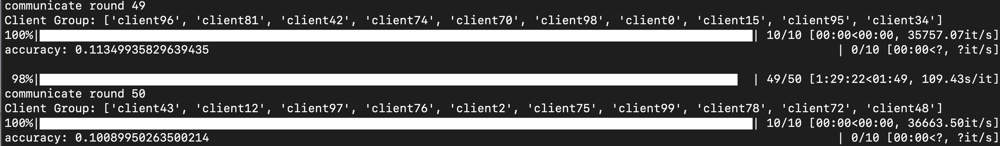

- 50个客户机，更新比例10%，50轮通讯

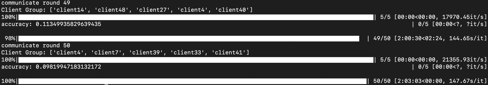

- 200个客户机，更新比例10%，50轮通讯

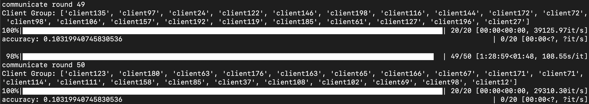

### 5.2 期望结果

参考[其他同学的工作](https://github.com/davidliyutong/ICE6405P-260-M01/tree/main/docs/Lab3/img)，并行式联邦学习的期望效果图如下：

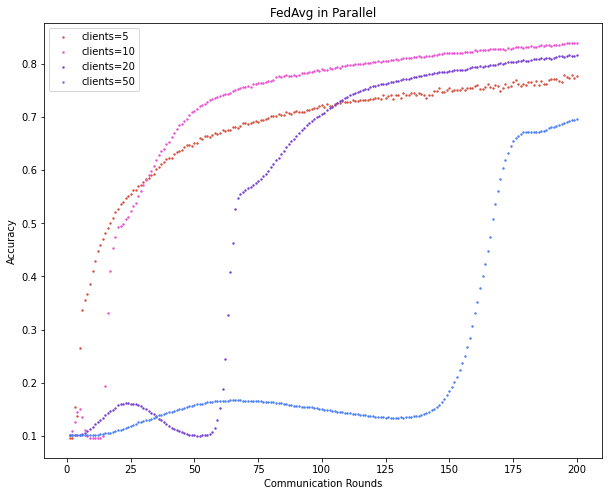

---

## 附录

### 上海交通大学云计算平台

- 本实验的计算资源

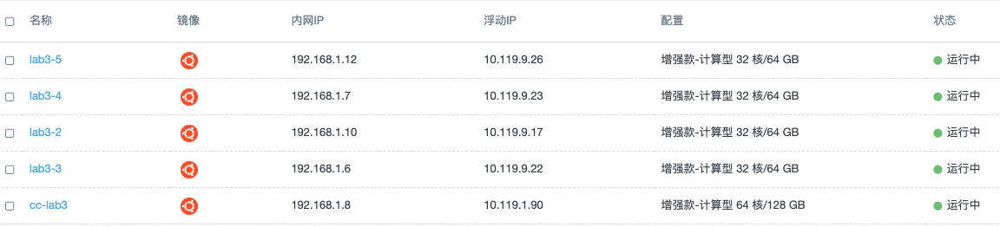

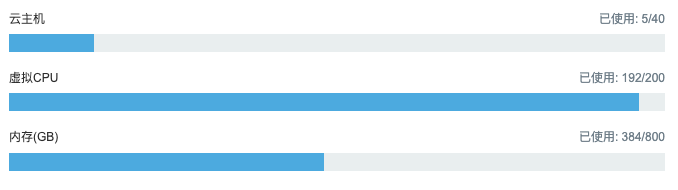


