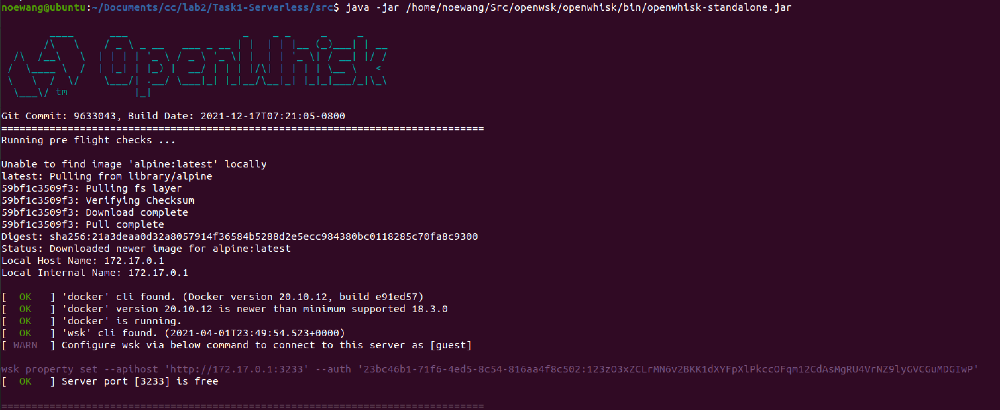
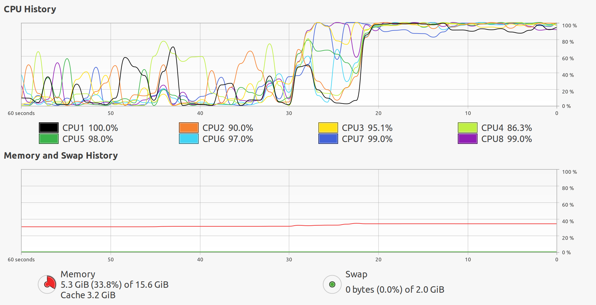

# 基于无服务计算框架的分布式训练及机器学习应用

作者：steve_wang@sjtu.edu.cn

日期：2022.01.14

## 任务1: 基于无服务器计算框架的机器学习应用

首先，我们要选择合适的无服务器计算框架，在此项目中，我们有如下三个选择：

1. AWS Lamda. AWS Lambda是最为广泛应用的无服务器计算框架，AWS为学生提供了免费的使用额度，使我们可以在AWS Lambda上部署我们的计算函数。
2. OpenWhisk. OpenWhisk是一个开源的无服务器计算框架，我们需要在本地部署 OpenWhisk 框架，并提交框架部署方法记录。
3. 其他**开源**无服务器计算框架。

在本项目中，我们选择使用开源的无服务器计算框架OpenWhisk。Openwhisk是属于Apache基金会的开源Faas计算平台，由IBM在2016年公布并贡献给开源社区。IBM Cloud本身也提供完全托管的OpenWhisk Faas服务IBM Cloud Function。从业务逻辑来看，OpenWhisk同AWS Lambda一样，为用户提供基于事件驱动的无状态的计算模型，并直接支持多种编程语言。

OpenWhisk特点：

- 高性能，高扩展性的分布式FaaS计算平台
- 函数的代码及运行时全部在Docker容器中运行，利用Docker engine实现FaaS函数运行的管理、负载均衡、扩展.
- OpenWhisk所有其他组件(如：API网关，控制器，触发器等)也全部运行在 Docker容器中。这使得OpenWhisk全栈可以很容易的部署在任意IaaS/PaaS平台上。
- 相比其他FaaS实现(比如OpenFaaS)，OpenWhisk更像是一套完整的Serverless 解决方案，除了容器的调用和函数的管理，OpenWhisk 还包括了用户身份验证/鉴权、函数异步触发等功能。

目前支持的语言: Nodejs, Python, Java, php, Ruby, Go, Rust, dotnet, Ballerina, blackBoxes。

---

本实验的计算资源为：

- 计算平台：
    - `OS`: macOS Catalina 10.15.7
    - `Memory`: 32GB
    - `Processor`: Intel Core i9-9880H @ 2.3GHz * 16
    - `Platform`: VMware Fusion Pro 11.5.0

- 虚拟机环境：
    - `OS`: Ubuntu 20.04LTS
    - `Memory`: 16GB
    - `Disk Capacity`: 110GB
    - `Processor`: Intel Core i9-9880H @ 2.3GHz * 8

本实验的工作目录是: `cc/lab2/Task1-Serverless/` 

> 本实验基于[开源代码](https://github.com/davidliyutong/ICE6405P-260-M01/tree/main/docs/Lab2/Serverless)

---


### 1. 安装OpenWhisk无服务器计算框架

#### 1.1 安装依赖

- 运行脚本`setup-deps.sh` 

```bash
noewang@ubuntu:~/Documents/cc/lab2/Task1-Serverless/src$ bash setup-deps.sh
```

- `setup-deps.sh`

```bash
#!/bin/bash
PKG_MANAGER=apt-get

sudo $PKG_MANAGER clean
sudo $PKG_MANAGER update
sudo $PKG_MANAGER install build-essential \
                     ninja-build \
					 meson \
					 libmount-dev \
					 libpixman-1-dev \
					 libusb-1.0 \
					 libglib2.0-dev \
					 openjdk-11-jdk \
					 nodejs \
					 npm \
					 git \
					 curl \
					 autoconf \
					 libtool \
					 libgtk-3-dev \
					 clang \
					 libsysfs-dev -y
sudo $PKG_MANAGER clean
sudo $PKG_MANAGER autoclean
```

#### 1.2 安装docker

- 运行脚本`setup-docker.sh`

```bash 
noewang@ubuntu:~/Documents/cc/lab2/Task1-Serverless/src$ bash setup-docker.sh
```

- `setup-docker.sh`

```bash
#!/bin/bash
# ------- BEGIN CONFIGURATION ------- #
PKG_MANAGER=apt-get
# -------- END CONFIGURATION -------- #

sudo $PKG_MANAGER clean
sudo $PKG_MANAGER autoclean

sudo $PKG_MANAGER update
if [[ $? -ne $(expr 0) ]]; then
echo "apt-get encountered problem, exit."
exit
fi

# Setup docker
if [[ ! $(docker --version | grep version) ]]; then
echo "Installing docker"
curl -fsSL https://get.docker.com -o get-docker.sh
set +e
sudo sh get-docker.sh
rm get-docker.sh
set -e
fi

# Add current user to docker group
# if [[ ! $(docker ps | grep CONTAINER) ]]; then 
# echo "Adding current user to docker group"
sudo usermod -aG docker $USER
newgrp docker
sudo systemctl restart docker

echo "Installation completed"

fi
```

#### 1.3 安装OpenWhisk

- 运行脚本`setup-openwsk.sh`

```bash
noewang@ubuntu:~/Documents/cc/lab2/Task1-Serverless/src$ bash setup-openwsk.sh
```

- `setup-openwsk.sh`

```bash
#!/bin/bash
# ------- BEGIN CONFIGURATION ------- #
SRC_PATH=~/Src/openwsk
OPENWSK_VERSION=1.0.0
OPENWSK_CLI_VERSION=1.2.0
ARCH=amd64
# -------- END CONFIGURATION -------- #

CURR_PATH=$(pwd)
set -e


if [ ! -d "$SRC_PATH" ]; then
echo "making dir $SRC_PATH" && mkdir -p "$SRC_PATH"
fi
cd $SRC_PATH

# Download openwhisk source code
if [ ! -d "openwhisk" ]; then
set +e
timeout 2m git clone --recursive https://github.com/apache/openwhisk.git
if [[ $? -ne $(expr 0) ]]; then
rm -rf openwhisk
set -e
# In case of bad internet connection, use mirror
git clone --recursive https://hub.fastgit.org/apache/openwhisk.git
fi
fi

cd openwhisk
# Do not checkout v1.0.0, use code from master branch
# git checkout $OPENWSK_VERSION
# Build OpenWhisk with gradlew
./gradlew core:standalone:build

if [ ! -f "OpenWhisk_CLI-$OPENWSK_CLI_VERSION-linux-$ARCH.tgz" ]; then
set +e
wget https://github.com/apache/openwhisk-cli/releases/download/$OPENWSK_CLI_VERSION/OpenWhisk_CLI-$OPENWSK_CLI_VERSION-linux-$ARCH.tgz
if [[ $? -ne $(expr 0) ]]; then
# In case of bad internet connection, use mirror
set -e
wget https://hub.fastgit.org/apache/openwhisk-cli/releases/download/$OPENWSK_CLI_VERSION/OpenWhisk_CLI-$OPENWSK_CLI_VERSION-linux-$ARCH.tgz
fi
fi

tar -xzvf OpenWhisk_CLI-$OPENWSK_CLI_VERSION-linux-$ARCH.tgz 
sudo mv wsk /usr/local/bin/
echo "alias start-openwsk=\"java -jar $SRC_PATH/openwhisk/bin/openwhisk-standalone.jar\"
" >> $PROFILE
echo "Installation completed, 'wsk' command should be available. Run OpenWhisk with 'java -jar $SRC_PATH/openwhisk/bin/openwhisk-standalone.jar' or the alias 'start-openwsk'"
cd $CURR_PATH

```

#### 1.4 启动OpenWhisk


- 输入命令，启动OpenWhisk服务器

```bash
noewang@ubuntu:~/Documents/cc/lab2/Task1-Serverless/src$ java -jar /home/noewang/Src/openwsk/openwhisk/bin/openwhisk-standalone.jar
```

- 看到下图



- 当前的OpenWhisk的例子的凭证：

```bash
[ WARN  ] Configure wsk via below command to connect to this server as [guest]

wsk property set --apihost 'http://172.17.0.1:3233' --auth '23bc46b1-71f6-4ed5-8c54-816aa4f8c502:123zO3xZCLrMN6v2BKK1dXYFpXlPkccOFqm12CdAsMgRU4VrNZ9lyGVCGuMDGIwP'
```

- 在新的终端，连接到服务器

```bash
noewang@ubuntu:~/Documents/cc/lab2/Task1-Serverless/src$ wsk property set --apihost 'http://172.17.0.1:3233' --auth '23bc46b1-71f6-4ed5-8c54-816aa4f8c502:123zO3xZCLrMN6v2BKK1dXYFpXlPkccOFqm12CdAsMgRU4VrNZ9lyGVCGuMDGIwP'
ok: whisk auth set. Run 'wsk property get --auth' to see the new value.
ok: whisk API host set to http://172.17.0.1:3233
```

- 现在我们可以通过`wsk`命令来操作OpenWhisk了

#### 1.5 验证OpenWhisk安装

- 创建一个`test.js` 来测试一下OpenWhisk

```bash
noewang@ubuntu:~/Documents/cc/lab2/Task1-Serverless/src$ echo " function main(params) {var name = params.name || 'World'; return {payload:  'Hello, ' + name + '\!'};}" > test.js
```

- 创建OpenWhisk行为（Action）来连接这个函数

```bash
noewang@ubuntu:~/Documents/cc/lab2/Task1-Serverless/src$ wsk action create hello test.js
ok: created action hello
```

- 运行这个函数

```bash
noewang@ubuntu:~/Documents/cc/lab2/Task1-Serverless/src$ wsk action invoke hello --result
{
    "payload": "Hello, World!"
}
```

---

### 2. 部署机器学习应用

本章节使用的ML预测性任务为基于CNN的MNIST手写数字辨识项目，我们从`GitHub` 上找到了一个使用`PyTorch`在MNIST数据集上训练好的CNN模型，以及相关的部署代码。由于OpenWhisk框架的限制，所有函数的输入和输出都必须为`.json` 文件，这使得直接传入图片变得有些困难。该代码将ML模型包装成一个WebApp，以便于OpenWhisk的函数在docker容器中可以仅通过URL来获取图片。

在本实验中，我们在一个开源的Docker容器中，下载已经训练好的开源的模型检查点，使用HTTP Server将其加载到模型，并使用OpenWhisk框架进行预测任务。我们的工作流程如下：

1. 从开源项目中搭建Docker镜像；
2. 在Docker中运行基于flask的WebApp；
3. 创建OpenWhisk Action；
4. 启动HTTP Server；
5. Invoke刚才定义的OpenWhisk Action，传入预测图片的URL；
6. 获得预测结果。

#### 2.1 定义机器学习任务

在本实验中，我们选择基于MNIST数据集的手写数字辨识项目，模型为基于PyTorch实现的LeNet5模型。

MNIST数据集由训练集和测试集组成，训练集包含60000个训练样本，测试集包含10000个测试样本。如下图，每个样本都是大小为28*28的单通道黑白图片，图片内容为手写数字，一共有10个类，标签分别为0-9. 该任务为预测型任务，要求模型对输入图片进行分类。


LeNet5是一个简单有效的卷积神经网（CNN），由YANN LECUN等人于1998年提出，它的结构如下图。本实验中，我们使用基于PyTorch实现的LeNet5模型进行预测。


#### 2.2 为机器学习应用创建Docker镜像

OpenWhisk支持Docker行为，但是存在一些限制，为此，我们从**公开的Docker镜像中**找到了一个合适于本实验的`natrium233/python3action-mnist:1.3`，它满足：

1. 此镜像基于Ubuntu；
2. 它下载和安装了conda；
3. 它创建了一个虚拟环境叫做`mnist`;
4. 在`mnist`环境中安装了flask和PyTorch；
5. 它能够自行部署此ML应用。

- 这个镜像的`dockerfile`如下：

```dockerfile
FROM python:3.8.8-slim

ENV LANG=C.UTF-8

WORKDIR /opt/app/

RUN pip config set global.index-url https://pypi.tuna.tsinghua.edu.cn/simple && \
    pip install minio pillow tqdm flask gevent requests onnx onnxruntime

ENV PATH_TO_ONNX_MODEL=/opt/app/model.onnx

COPY ["checkpoints/model.onnx", "deploy-flask.py", "/opt/app/"]

EXPOSE 8080

CMD ["/bin/bash", "-c", "python /opt/app/deploy-flask.py"]
```

- 我们也可以运行`build.sh`来在本地创建Docker镜像，但是需要OpenWhisk只能从公开的Docker镜像运行，因此还需要将其公布。
- 在后续的实验中，我们将使用其他用户已经公开的Docker镜像`natrium233/python3action-mnist:1.3`来进行之后的实验。

#### 2.3 基于HTTP Server部署机器学习应用

##### 2.3.1 启动OpenWhisk无服务器计算框架

- 在`Terminal 1`启动OpenWhisk

```bash
noewang@ubuntu:~/Documents/cc/lab2/Task1-Serverless$ java -jar /home/noewang/Src/openwsk/openwhisk/bin/openwhisk-standalone.jar
```

##### 2.3.2 启动HTTP Server

- 在`Terminal 2`进入测试图片所在的文件夹，启动HTTP Server，端口为`8000` 。这一步是为了将本地的图片放在HTTP服务器上，使得OpenWhisk的函数可以通过网络URL来下载图片到容器中，并输入模型。

```bash
noewang@ubuntu:~/Documents/cc/lab2/Task1-Serverless$ cd pics
noewang@ubuntu:~/Documents/cc/lab2/Task1-Serverless/pics$ python3 -m http.server
Serving HTTP on 0.0.0.0 port 8000 (http://0.0.0.0:8000/) ...
```

##### 2.3.3 从Docker镜像创建OpenWhisk行为

- 在`Terminal 3` 创建一个OpenWhisk的Action，它使用公开的Docker镜像`natrium233/python3action-mnist:1.3`，叫做`mnist`。在这个Docker镜像中，一个flask服务器已经加载训练好的模型检查点并可以进行预测，详情见`$WORK_DIR/code/deploy-flask.py` 

```bash
noewang@ubuntu:~/Documents/ICE6405P-260-M01/docs/Lab2/Serverless/$ wsk action create mnist --docker natrium233/python3action-mnist:1.3
ok: created action mnist
```

##### 2.3.4 唤醒OpenWhisk行为

- 在`Terminal 3` Invoke这个Action，我们传入的是`label=0`的手写数字图片，我们看到模型预测的结果也为`0` 

```bash
noewang@ubuntu:~/Documents/cc/lab2/Task1-Serverless$ wsk action invoke mnist --result --param url "http://172.17.0.1:8000/label0.png"
{
    "code": 200,
    "res": 0
}
```

##### 2.3.5 模型预测结果

- 我们在`Terminal 3`中换不同的label的图片多进行几次尝试：

```bash
noewang@ubuntu:~/Documents/cc/lab2/Task1-Serverless$ wsk action invoke mnist --result --param url "http://172.17.0.1:8000/label0.png"
{
    "code": 200,
    "res": 0
}
noewang@ubuntu:~/Documents/cc/lab2/Task1-Serverless$ wsk action invoke mnist --result --param url "http://172.17.0.1:8000/label1.png"
{
    "code": 200,
    "res": 1
}
noewang@ubuntu:~/Documents/cc/lab2/Task1-Serverless$ wsk action invoke mnist --result --param url "http://172.17.0.1:8000/label2.png"
{
    "code": 200,
    "res": 2
}
noewang@ubuntu:~/Documents/cc/lab2/Task1-Serverless$ wsk action invoke mnist --result --param url "http://172.17.0.1:8000/label3.png"
{
    "code": 200,
    "res": 3
}
noewang@ubuntu:~/Documents/cc/lab2/Task1-Serverless$ wsk action invoke mnist --result --param url "http://172.17.0.1:8000/label4.png"
{
    "code": 200,
    "res": 4
}
noewang@ubuntu:~/Documents/cc/lab2/Task1-Serverless$ wsk action invoke mnist --result --param url "http://172.17.0.1:8000/label5.png"
{
    "code": 200,
    "res": 3
}
noewang@ubuntu:~/Documents/cc/lab2/Task1-Serverless$ wsk action invoke mnist --result --param url "http://172.17.0.1:8000/label6.png"
{
    "code": 200,
    "res": 6
}
noewang@ubuntu:~/Documents/cc/lab2/Task1-Serverless$ wsk action invoke mnist --result --param url "http://172.17.0.1:8000/label7.png"
{
    "code": 200,
    "res": 7
}
noewang@ubuntu:~/Documents/cc/lab2/Task1-Serverless$ wsk action invoke mnist --result --param url "http://172.17.0.1:8000/label8.png"
{
    "code": 200,
    "res": 8
}
noewang@ubuntu:~/Documents/cc/lab2/Task1-Serverless$ wsk action invoke mnist --result --param url "http://172.17.0.1:8000/label9.png"
{
    "code": 200,
    "res": 9
}
```

- 在`Terminal 2`中，我们可以看到HTTP访问记录：

```bash
noewang@ubuntu:~/Documents/cc/lab2/Task1-Serverless/pics$ python3 -m http.server
Serving HTTP on 0.0.0.0 port 8000 (http://0.0.0.0:8000/) ...
172.17.0.4 - - [07/Jan/2022 19:27:44] "GET /label0.png HTTP/1.1" 200 -
172.17.0.4 - - [07/Jan/2022 19:30:19] "GET /label1.png HTTP/1.1" 200 -
172.17.0.4 - - [07/Jan/2022 19:30:21] "GET /label2.png HTTP/1.1" 200 -
172.17.0.4 - - [07/Jan/2022 19:30:24] "GET /label3.png HTTP/1.1" 200 -
172.17.0.4 - - [07/Jan/2022 19:30:27] "GET /label4.png HTTP/1.1" 200 -
172.17.0.4 - - [07/Jan/2022 19:30:30] "GET /label5.png HTTP/1.1" 200 -
172.17.0.4 - - [07/Jan/2022 19:30:33] "GET /label6.png HTTP/1.1" 200 -
172.17.0.4 - - [07/Jan/2022 19:30:36] "GET /label7.png HTTP/1.1" 200 -
172.17.0.4 - - [07/Jan/2022 19:30:39] "GET /label8.png HTTP/1.1" 200 -
172.17.0.4 - - [07/Jan/2022 19:30:42] "GET /label9.png HTTP/1.1" 200 -
```

----


## 任务2：基于无服务器计算框架的分布式训练

在本实验中，我们需要自定义分布式机器学习训练任务，在任务1中选择的无服务器计算框架部署训练任务，并进行分布式训练。在任务1中，我们选择开源的无服务器计算框架OpenWhisk，并选择基于PyTorch实现的MINIST数据集手写数字辨识任务。在本任务中，我们依然选择MNIST手写数字辨识任务，并基于OpenWhisk框架对任务1中的LeNet5模型进行分布式训练。

---

本实验的计算资源为：

- 计算平台：
    - `OS`: macOS Catalina 10.15.7
    - `Memory`: 32GB
    - `Processor`: Intel Core i9-9880H @ 2.3GHz * 16
    - `Platform`: VMware Fusion Pro 11.5.0

- 虚拟机环境：
    - `OS`: Ubuntu 20.04LTS
    - `Memory`: 16GB
    - `Disk Capacity`: 110GB
    - `Processor`: Intel Core i9-9880H @ 2.3GHz * 8

本实验的工作目录是: `WORK_DIR=cc/lab2/Task2-DistributedTraining`

> 本实验基于[开源代码](https://github.com/davidliyutong/ICE6405P-260-M01/tree/main/docs/Lab2/DistributedTraining) 

### 1. 定义分布式机器学习任务

在本任务中，我们依旧选择MNIST手写数字辨识任务，选择基于PyTorch实现的LeNet5作为模型。MNIST数据集的训练集包含60000个样本，我们将其平均分为6份，储存在`$WORK_DIR/code/dataset_deploy`中。我们将在这六个数据集上进行分布式训练。

```bash
noewang@ubuntu:~/Documents/cc/lab2/Task2-DistributedTraining/code/dataset_deploy$ ls
dataset_dl_1.tar.gz  dataset_dl_3.tar.gz  dataset_dl_5.tar.gz  README.md
dataset_dl_2.tar.gz  dataset_dl_4.tar.gz  dataset_dl_6.tar.gz
```

### 2. 创建Docker镜像

在本实验中，我们使用**公开的Docker镜像**`natrium233/python3action-dist-train-mnist:1.1`，它的`Dockerfile`如下：

```dockerfile
FROM python:3.8.8-slim
# FROM cuda:10.1

ENV LANG=C.UTF-8

WORKDIR /opt/app/

RUN pip config set global.index-url https://pypi.tuna.tsinghua.edu.cn/simple && \
    pip install minio pillow tqdm flask gevent requests && \
    pip install torch==1.8.0+cpu torchvision==0.9.0+cpu torchaudio==0.8.0 -f https://download.pytorch.org/whl/torch_stable.html

COPY ["models.py","worker_utils.py","run_worker.py", "/opt/app/"]

EXPOSE 8080

CMD ["/bin/bash", "-c", "python ./run_worker.py"]
```

- 我们也可以运行`scripts/build.sh`来在本地创建Docker镜像，但是需要OpenWhisk只能从公开的Docker镜像运行，因此还需要将其公布。
- 在后续的实验中，我们将使用其他用户已经公开的Docker镜像`natrium233/python3action-dist-train-mnist:1.1`来进行实验。

### 3. 部署分布式训练任务

#### 3.1 启动OpenWhisk无服务器计算框架

- 在`Terminal 1` 启动OpenWhisk无服务器计算框架

```bash
noewang@ubuntu:~/Documents/cc/lab2/Task2-DistributedTraining$ java -jar /home/noewang/Src/openwsk/openwhisk/bin/openwhisk-standalone.jar
```

#### 3.2 启动HTTP服务器

- 在`Terminal 2` 进入目录`code/dataset_deploy`，启动HTTP服务器，端口为`8000`. 这一步是将本地的训练集放在HTTP服务器上，使得OpenWhisk的函数可以通过网络URL来下载训练集到容器中，并传递给模型。

```bash
noewang@ubuntu:~/Documents/cc/lab2/Task2-DistributedTraining/code/dataset_deploy$ python3 -m http.server
Serving HTTP on 0.0.0.0 port 8000 (http://0.0.0.0:8000/) ...
```

#### 3.3 启动分布式训练服务器

- 在`Terminal 3` 运行`code/run_server.py`脚本，启动分布式训练服务器，端口为`29500` . 

```bash
noewang@ubuntu:~/Documents/cc/lab2/Task2-DistributedTraining$ python3 code/run_server.py 
[ Info ] Start server at 0.0.0.0:29500
 * Serving Flask app 'run_server' (lazy loading)
 * Environment: production
   WARNING: This is a development server. Do not use it in a production deployment.
   Use a production WSGI server instead.
 * Debug mode: off
 * Running on all addresses.
   WARNING: This is a development server. Do not use it in a production deployment.
 * Running on http://192.168.36.193:29500/ (Press CTRL+C to quit)

```

#### 3.4 从Docker镜像创建OpenWhisk行为

- 在`Terminal 4` 创建一个OpenWhisk的Action，它使用公开的Docker镜像`natrium233/python3action-dist-train-mnist:1.1`，叫做`dist-train`。在这个Docker镜像中，一个worker正在等待数据集进行训练，详情见`$WORK_DIR/code/run_worker.py`  

```bash
noewang@ubuntu:~/Documents/cc/lab2/Task2-DistributedTraining$ wsk action create dist-train --docker natrium233/python3action-dist-train-mnist:1.1 --timeout 300000
ok: created action dist-train
```

#### 3.5 唤醒分布式训练行为

- 在`Terminal 4` 中运行`wsk-invoke-dist-train-2workers.sh`

```bash
noewang@ubuntu:~/Documents/cc/lab2/Task2-DistributedTraining$ bash wsk-invoke-dist-train-2workers.sh 
ok: invoked /_/dist-train with id d3e38abb0225431ca38abb0225731c52
ok: invoked /_/dist-train with id 8bacbdd913b04785acbdd913b0e7854b
```

```bash
# wsk-invoke-dist-train-2workers.sh
wsk action invoke dist-train \
    --param batch_sz_train 32 \
    --param epoch_n 8 \
    --param apihost 'http://172.17.0.2:29500' \
    --param update_intv 8 \
    --param dataset_url 'http://172.17.0.2:8000/dataset_dl_1.tar.gz' \
    --param device cpu

wsk action invoke dist-train \
    --param batch_sz_train 32 \
    --param epoch_n 8 \
    --param apihost 'http://172.17.0.2:29500' \
    --param update_intv 8 \
    --param dataset_url 'http://172.17.0.2:8000/dataset_dl_2.tar.gz' \
    --param device cpu
```

>分布式服务器：`172.17.0.2:29500`，为docker创建的网卡地址 
>
>HTTP服务器：`172.17.0.2:8000`，为docker创建的网卡地址 

- 在`Terminal 4` 中输入`docker stats` 查看资源占用情况

```bash
noewang@ubuntu:~/Documents/cc/lab2/Task2-DistributedTraining$ docker stats
CONTAINER ID   NAME                       CPU %     MEM USAGE / LIMIT   MEM %     NET I/O           BLOCK I/O        PIDS
20759a91239b   wsk0_11_prewarm_nodejs14   0.00%     9.461MiB / 256MiB   3.70%     3.75kB / 0B       0B / 0B          8
dd43aa5ad684   wsk0_12_guest_disttrain    350.75%   177MiB / 256MiB     69.15%    71.3MB / 89.4MB   24.5MB / 140MB   18
0f42d5a32694   wsk0_13_guest_disttrain    346.50%   165.2MiB / 256MiB   64.53%    24.6MB / 2.09MB   4.83MB / 55MB    18
```

- 在`Terminal 2`，我们可以看到数据集访问记录

```bash
noewang@ubuntu:~/Documents/cc/lab2/Task2-DistributedTraining/code/dataset_deploy$ python3 -m http.server
Serving HTTP on 0.0.0.0 port 8000 (http://0.0.0.0:8000/) ...
172.17.0.3 - - [08/Jan/2022 02:17:58] "GET /dataset_dl_1.tar.gz HTTP/1.1" 200 -
172.17.0.4 - - [08/Jan/2022 02:18:03] "GET /dataset_dl_2.tar.gz HTTP/1.1" 200 -
```

- 在`Terminal 3` ，我们可以看到分布式训练服务器的记录（1个Optimization Step）

```bash
[ Info ] Optimizer step
172.17.0.4 - - [08/Jan/2022 02:22:52] "POST /putGradient HTTP/1.1" 200 -
172.17.0.4 - - [08/Jan/2022 02:22:52] "GET /getVersion HTTP/1.1" 200 -
172.17.0.4 - - [08/Jan/2022 02:22:52] "GET /getParameter HTTP/1.1" 200 -
172.17.0.3 - - [08/Jan/2022 02:22:52] "GET /getVersion HTTP/1.1" 200 -
172.17.0.3 - - [08/Jan/2022 02:22:52] "GET /getParameter HTTP/1.1" 200 -
172.17.0.4 - - [08/Jan/2022 02:22:52] "GET /getVersion HTTP/1.1" 200 -
172.17.0.3 - - [08/Jan/2022 02:22:53] "GET /getVersion HTTP/1.1" 200 -
172.17.0.4 - - [08/Jan/2022 02:22:53] "GET /getVersion HTTP/1.1" 200 -
172.17.0.3 - - [08/Jan/2022 02:22:54] "POST /putGradient HTTP/1.1" 201 -
172.17.0.3 - - [08/Jan/2022 02:22:54] "GET /getVersion HTTP/1.1" 200 -
172.17.0.4 - - [08/Jan/2022 02:22:54] "GET /getVersion HTTP/1.1" 200 -
172.17.0.3 - - [08/Jan/2022 02:22:55] "GET /getVersion HTTP/1.1" 200 -
172.17.0.4 - - [08/Jan/2022 02:22:55] "GET /getVersion HTTP/1.1" 200 -
172.17.0.3 - - [08/Jan/2022 02:22:55] "GET /getVersion HTTP/1.1" 200 -
172.17.0.4 - - [08/Jan/2022 02:22:55] "GET /getVersion HTTP/1.1" 200 -
172.17.0.3 - - [08/Jan/2022 02:22:56] "GET /getVersion HTTP/1.1" 200 -
172.17.0.4 - - [08/Jan/2022 02:22:56] "GET /getVersion HTTP/1.1" 200 -
172.17.0.3 - - [08/Jan/2022 02:22:57] "GET /getVersion HTTP/1.1" 200 -
172.17.0.4 - - [08/Jan/2022 02:22:57] "GET /getVersion HTTP/1.1" 200 -
172.17.0.3 - - [08/Jan/2022 02:22:57] "GET /getVersion HTTP/1.1" 200 -
172.17.0.4 - - [08/Jan/2022 02:22:57] "POST /putGradient HTTP/1.1" 201 -
172.17.0.4 - - [08/Jan/2022 02:22:57] "GET /getVersion HTTP/1.1" 200 -
172.17.0.3 - - [08/Jan/2022 02:22:58] "GET /getVersion HTTP/1.1" 200 -
172.17.0.4 - - [08/Jan/2022 02:22:58] "GET /getVersion HTTP/1.1" 200 -
172.17.0.3 - - [08/Jan/2022 02:22:59] "GET /getVersion HTTP/1.1" 200 -
172.17.0.4 - - [08/Jan/2022 02:22:59] "GET /getVersion HTTP/1.1" 200 -
172.17.0.4 - - [08/Jan/2022 02:23:00] "GET /getVersion HTTP/1.1" 200 -
172.17.0.3 - - [08/Jan/2022 02:23:00] "POST /putGradient HTTP/1.1" 201 -
172.17.0.3 - - [08/Jan/2022 02:23:00] "GET /getVersion HTTP/1.1" 200 -
172.17.0.4 - - [08/Jan/2022 02:23:00] "GET /getVersion HTTP/1.1" 200 -
172.17.0.3 - - [08/Jan/2022 02:23:00] "GET /getVersion HTTP/1.1" 200 -
172.17.0.4 - - [08/Jan/2022 02:23:01] "GET /getVersion HTTP/1.1" 200 -
172.17.0.3 - - [08/Jan/2022 02:23:01] "GET /getVersion HTTP/1.1" 200 -
172.17.0.4 - - [08/Jan/2022 02:23:02] "GET /getVersion HTTP/1.1" 200 -
172.17.0.3 - - [08/Jan/2022 02:23:02] "GET /getVersion HTTP/1.1" 200 -
172.17.0.4 - - [08/Jan/2022 02:23:02] "GET /getVersion HTTP/1.1" 200 -
172.17.0.3 - - [08/Jan/2022 02:23:02] "GET /getVersion HTTP/1.1" 200 -
172.17.0.3 - - [08/Jan/2022 02:23:03] "GET /getVersion HTTP/1.1" 200 -

```

#### 3.6 对比实验

- 我们继续运行`wsk-invoke-dist-train-4workers.sh`，来观察增加分布式训练的进程对每个进程的影响

```bash
CONTAINER ID   NAME                       CPU %     MEM USAGE / LIMIT   MEM %     NET I/O           BLOCK I/O      PIDS
013d784caafe   wsk0_23_guest_disttrain    220.06%   164.7MiB / 256MiB   64.32%    25.1MB / 2.35MB   0B / 55MB      18
269f5174f097   wsk0_25_guest_disttrain    216.87%   164.6MiB / 256MiB   64.32%    25.1MB / 2.35MB   0B / 55MB      18
7b5bd908e19e   wsk0_24_guest_disttrain    219.03%   164.5MiB / 256MiB   64.28%    25.1MB / 2.35MB   946kB / 55MB   18
04c8e1411328   wsk0_14_prewarm_nodejs14   0.00%     9.449MiB / 256MiB   3.69%     4.7kB / 0B        0B / 0B        8
```

- 虽然我们尝试添加4个workers，然而我们只观察到3个workers在运行，我们猜测**这应该是OpenWhisk对运行内存有限制，可能为512MB**。
- 我们在HTTP服务器观察到4个workers分别提取了训练文件，如下

```bash
noewang@ubuntu:~/Documents/cc/lab2/Task2-DistributedTraining/code/dataset_deploy$ python3 -m http.server
Serving HTTP on 0.0.0.0 port 8000 (http://0.0.0.0:8000/) ...
172.17.0.2 - - [08/Jan/2022 02:29:59] "GET /dataset_dl_3.tar.gz HTTP/1.1" 200 -
172.17.0.3 - - [08/Jan/2022 02:29:59] "GET /dataset_dl_1.tar.gz HTTP/1.1" 200 -
172.17.0.4 - - [08/Jan/2022 02:29:59] "GET /dataset_dl_2.tar.gz HTTP/1.1" 200 -
172.17.0.2 - - [08/Jan/2022 02:30:37] "GET /dataset_dl_4.tar.gz HTTP/1.1" 200 -
```

- 我们看到虚拟机的内存资源充足，性能瓶颈为CPU，这符合我们的预期



- 从我们的对比实验可以看出来，当有2个worker的时候，虚拟机分布式学习的CPU利用率大约为：$(350\%+346\%)\div800\%≈87\%$；当有3个worker的时候，虚拟机分布式学习的CPU利用率大约为：$(220\%+217\%+219\%)\div800\%≈82\%$ ，略有下降。
