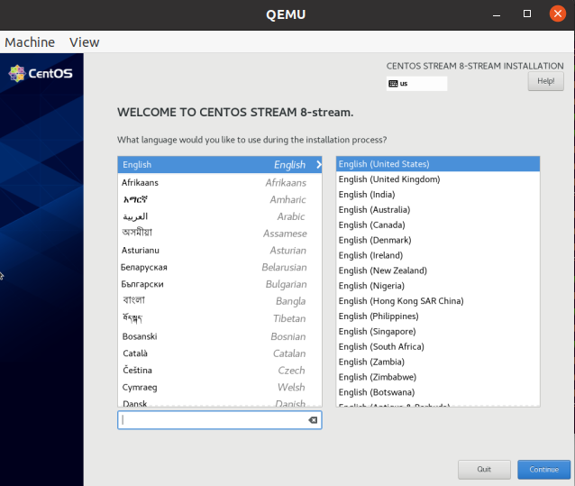
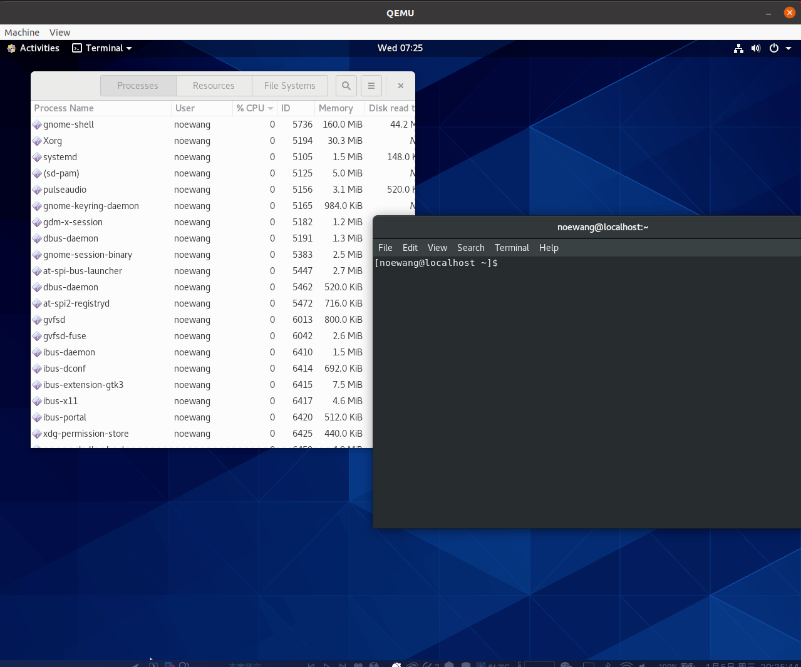
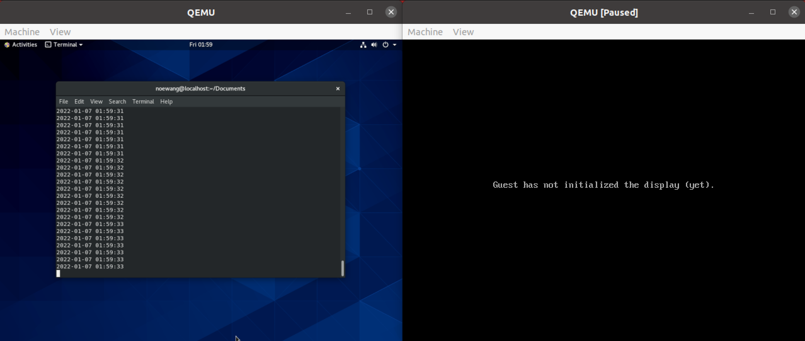
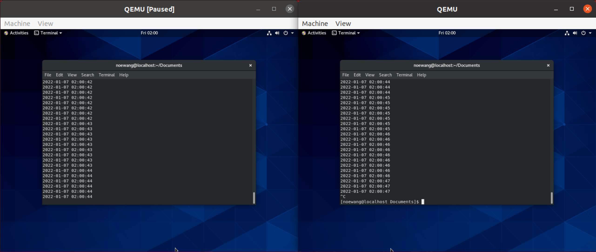

# 基于KVM的网络虚拟化和虚拟机热迁移

作者：steve_wang@sjtu.edu.cn
日期：2022.01.12

## 1. 任务介绍

在本任务中，我们需要完成以下要求：

1. 基于QEMU/KVM创建一个使用`virtio-net`的虚拟机：
    - 虚拟机安装CentOS操作系统；
    - 虚拟机可以通过`virtio-net` 设备访问外部网络；

2. 高性能的虚拟网络是云计算核心之一：

    - 基于DPDK和OVS，部署`vhost-user` 方案；

    - 评测`vhost-user` 方案和`virtio-net`方案；

3. 向高性能+多功能的方向优化：

    - 配置`vhost-user` 和QEMU启动参数，研究网络设备的多队列特性；

    - 在`vhost-user` 的基础上进行虚拟机热迁移；

---

本实验的计算资源为：

- 计算平台：
    - `OS`: macOS Catalina 10.15.7
    - `Memory`: 32GB
    - `Processor`: Intel Core i9-9880H @ 2.3GHz * 16
    - `Platform`: VMware Fusion Pro 11.5.0

- 虚拟机环境：
    - `OS`: Ubuntu 20.04LTS
    - `Memory`: 16GB
    - `Disk Capacity`: 110GB
    - `Processor`: Intel Core i9-9880H @ 2.3GHz * 8

本实验的工作目录是: `cc/lab1/` 

> 本实验参考[开源代码](https://github.com/davidliyutong/ICE6405P-260-M01/tree/main/docs/Lab1)

---

## 2. 配置环境

### 2.0 安装依赖

```console
noewang@ubuntu:~/Documents/cc/lab1$ bash src/setup-deps.sh
```

### 2.1 安装qemu

- 检查kvm

```console
noewang@ubuntu:~/Documents/cc/lab1$ lsmod | grep kvm
kvm_intel             294912  0
kvm                   823296  1 kvm_intel
```

- 安装qemu

```console
noewang@ubuntu:~/Documents/cc/lab1$ bash src/setup-qemu.sh
```

### 2.2. 安装CentOS

- 创建虚拟磁盘

```console
noewang@ubuntu:~/Documents/cc/lab1$ qemu-img create -f qcow2 centos_disk_0.img 10G
Formatting 'centos_disk_0.img', fmt=qcow2 cluster_size=65536 extended_l2=off compression_type=zlib size=10737418240 lazy_refcounts=off refcount_bits=16
noewang@ubuntu:~/Documents/cc/lab1$ file centos_disk_0.img
centos_disk_0.img: QEMU QCOW2 Image (v3), 10737418240 bytes
```

- 创建虚拟机

```console
noewang@ubuntu:~/Documents/cc/lab1$ bash qemu-setup-vm.sh
```

- `qemu-setup-vm.sh`

```bash
qemu-system-x86_64 -serial stdio \
    -smp 2,sockets=1,cores=2,threads=1 -m 4096 \
    -device virtio-gpu-pci \
    -display default,show-cursor=on \
    -device qemu-xhci -device usb-kbd \
    -device usb-tablet -device intel-hda \
    -device hda-duplex \
    -drive file=centos_disk_0.img,if=virtio,cache=writethrough \
	-cdrom CentOS-8-x86_64-1905-dvd1.iso \
    -nic user,model=virtio
```




- 启动虚拟机，我们把虚拟机的22端口映射到`localhost`的10122端口

```console
noewang@ubuntu:~/Documents/cc/lab1$ bash qemu-launch-vm.sh
```

- `qemu-launch-vm.sh`

```bash
qemu-system-x86_64 -serial stdio \
    -smp 6,sockets=1,cores=6,threads=1 -m 4096 \
    -device virtio-gpu-pci \
    -display default,show-cursor=on \
    -device qemu-xhci -device usb-kbd \
    -device usb-tablet -device intel-hda \
    -device hda-duplex \
    -enable-kvm \
    -drive file=centos_disk_0.img,if=virtio,cache=writethrough \
    -nic user,model=virtio,hostfwd=tcp::10122-:22
```



- 我们开启了`enable-kvm` 来使用`kvm`对虚拟机进行加速，在开启该选项前，我们的虚拟机在`6核+4GB内存`的配置下依旧很卡顿，且CPU占用率很高
- 开启`kvm`之后，host和VM的资源占用率如下图，虚拟机非常流畅


### 2.3 SSH连接虚拟机

- 我们通过SSH来连接虚拟机

```console
noewang@ubuntu:~/Documents/cc/lab1$ ssh -p 10122 localhost
The authenticity of host '[localhost]:10122 ([127.0.0.1]:10122)' can't be established.
ECDSA key fingerprint is SHA256:/UfGo/eI3wyOvC1u0zolTtbdKgVcwfEEZwsSWd7uPnY.
Are you sure you want to continue connecting (yes/no/[fingerprint])? yes
Warning: Permanently added '[localhost]:10122' (ECDSA) to the list of known hosts.
noewang@localhost's password: 
Activate the web console with: systemctl enable --now cockpit.socket

Last login: Thu Jan  6 01:51:06 2022
[noewang@localhost ~]$
```

- 通过`wget`交大主页`www.sjtu.edu.cn` 来测试网络可用

```console
[noewang@localhost Downloads]$ wget www.sjtu.edu.cn
--2022-01-06 01:54:40--  http://www.sjtu.edu.cn/
Resolving www.sjtu.edu.cn (www.sjtu.edu.cn)... 202.120.2.119, 2001:da8:8000:6fc0:102:1200:2:48
Connecting to www.sjtu.edu.cn (www.sjtu.edu.cn)|202.120.2.119|:80... connected.
HTTP request sent, awaiting response... 302 Found : Moved Temporarily
Location: https://www.sjtu.edu.cn/ [following]
--2022-01-06 01:54:40--  https://www.sjtu.edu.cn/
Connecting to www.sjtu.edu.cn (www.sjtu.edu.cn)|202.120.2.119|:443... connected.
HTTP request sent, awaiting response... 200 OK
Length: 75760 (74K) [text/html]
Saving to: ‘index.html’

index.html                100%[=====================================>]  73.98K  --.-KB/s    in 0.02s   

2022-01-06 01:54:40 (3.13 MB/s) - ‘index.html’ saved [75760/75760]
```

## 3. 部署DPDK和OVS

### 3.1 部署DPDK

- 我们使用厉宇桐同学的脚本`setup-dpdk.sh`

```console
noewang@ubuntu:~/Documents/cc/lab1$ bash src/setup-dpdk.sh
```

- 检查版本

```console
noewang@ubuntu:~/Documents/cc/lab1$ pkg-config --modversion libdpdk
20.11.1
```


### 3.2 部署OVS

- 安装

```console
noewang@ubuntu:~/Documents/cc/lab1$ bash src/setup-ovs.sh
```

- 启动OpenVSwitch

```console
noewang@ubuntu:~/Documents/cc/lab1$ bash start-ovs.sh 
...
true
ovs-vswitchd (Open vSwitch) 2.16.0
DPDK 20.11.1
```

- 创建OpenVSwitch端口和桥

```bash
noewang@ubuntu:~/Documents/cc/lab1$ bash ovs-create-port-bridge.sh 
c2ecea9e-5afd-4d16-b952-3acc2aaf3f7a
    Bridge br0
        datapath_type: netdev
        Port br0
            Interface br0
                type: internal
        Port vhost-user-0
            Interface vhost-user-0
                type: dpdkvhostuserclient
                options: {vhost-server-path="/tmp/sock0"}
        Port vhost-user-1
            Interface vhost-user-1
                type: dpdkvhostuserclient
                options: {vhost-server-path="/tmp/sock1"}

```

## 4. 网络虚拟化方案

### 4.1 启动虚拟机

#### 4.1.1 基于`vhost-user`方案的虚拟机

- 运行脚本`qemu-launch-vhost-user1.sh`

```bash
noewang@ubuntu:~/Documents/cc/lab1$ bash qemu-launch-vhost-user1.sh
```

#### 4.1.2 基于`virtio`方案的虚拟机

- 运行脚本`qemu-lauch-virtio.sh`

```bash
noewang@ubuntu:~/Documents/cc/lab1$ bash qemu-launch-virtio.sh
```

### 4.2 iperf3测试

#### 4.2.1 命令

- 在host上，监听`1314`端口，间隔为`1`秒

```bash
noewang@ubuntu:~/Documents/cc/lab1$ iperf3 -s -i 1 -p 1314
```

- 在VM上，使用`30`个客户端并行，持续时间为`10`秒

```bash
[noewang@localhost ~]$ iperf3 -c 192.168.36.193 -i 1 -P 30 -t 10 -p 1314
# 192.168.36.193 is the IP address of host
```

#### 4.2.2 结果

- `vhost`方案

```console
[SUM]   0.00-10.00  sec  1.64 GBytes  1.41 Gbits/sec    0             sender
[SUM]   0.00-10.00  sec  1.63 GBytes  1.40 Gbits/sec                  receiver
```

- `virtio` 方案

```bash
[SUM]   0.00-10.00  sec  1.43 GBytes  1.23 Gbits/sec    0             sender
[SUM]   0.00-10.00  sec  1.43 GBytes  1.23 Gbits/sec                  receiver
```

- 我们发现`vhost` 方案的带宽相较于`virtio` 方案提升了将近$13.8\%$ 


### 4.3 ping测试

#### 4.3.1 命令

- 在VM上，发送`10`个包给host IP = `192.168.36.193`

```bash
[noewang@localhost ~]$ ping -c 10 192.168.36.193
```

#### 4.3.2 结果

- `vhost` 方案

```bash
[noewang@localhost ~]$ ping -c 10 192.168.36.193
PING 192.168.36.193 (192.168.36.193) 56(84) bytes of data.
64 bytes from 192.168.36.193: icmp_seq=1 ttl=255 time=0.762 ms
64 bytes from 192.168.36.193: icmp_seq=2 ttl=255 time=0.446 ms
64 bytes from 192.168.36.193: icmp_seq=3 ttl=255 time=0.492 ms
64 bytes from 192.168.36.193: icmp_seq=4 ttl=255 time=0.438 ms
64 bytes from 192.168.36.193: icmp_seq=5 ttl=255 time=0.443 ms
64 bytes from 192.168.36.193: icmp_seq=6 ttl=255 time=0.453 ms
64 bytes from 192.168.36.193: icmp_seq=7 ttl=255 time=0.519 ms
64 bytes from 192.168.36.193: icmp_seq=8 ttl=255 time=0.477 ms
64 bytes from 192.168.36.193: icmp_seq=9 ttl=255 time=0.457 ms
64 bytes from 192.168.36.193: icmp_seq=10 ttl=255 time=0.509 ms

--- 192.168.36.193 ping statistics ---
10 packets transmitted, 10 received, 0% packet loss, time 237ms
rtt min/avg/max/mdev = 0.438/0.499/0.762/0.094 ms
```

- `virtio` 方案

```bash
[noewang@localhost ~]$ ping -c 10 192.168.36.193
PING 192.168.36.193 (192.168.36.193) 56(84) bytes of data.
64 bytes from 192.168.36.193: icmp_seq=1 ttl=255 time=0.590 ms
64 bytes from 192.168.36.193: icmp_seq=2 ttl=255 time=0.513 ms
64 bytes from 192.168.36.193: icmp_seq=3 ttl=255 time=0.494 ms
64 bytes from 192.168.36.193: icmp_seq=4 ttl=255 time=0.551 ms
64 bytes from 192.168.36.193: icmp_seq=5 ttl=255 time=0.463 ms
64 bytes from 192.168.36.193: icmp_seq=6 ttl=255 time=0.543 ms
64 bytes from 192.168.36.193: icmp_seq=7 ttl=255 time=0.411 ms
64 bytes from 192.168.36.193: icmp_seq=8 ttl=255 time=0.482 ms
64 bytes from 192.168.36.193: icmp_seq=9 ttl=255 time=0.449 ms
64 bytes from 192.168.36.193: icmp_seq=10 ttl=255 time=0.509 ms

--- 192.168.36.193 ping statistics ---
10 packets transmitted, 10 received, 0% packet loss, time 247ms
rtt min/avg/max/mdev = 0.411/0.500/0.590/0.054 ms
```

- 整体看起来，网络延迟方面没有什么区别

## 5. 多队列技术

网卡多队列技术是指将各个队列通过中断绑定到不同的核上，从而解决网络I/O带宽升高时单核CPU的处理瓶颈，提升网络PPS和带宽性能。经过测试，在相同的网络PPS和网络带宽的条件下，与1个队列相比，2个队列最多可提升性能达50%到100%，4个队列的性能提升更大。

- 在host上运行脚本`qemu-launch-multiqueue.sh`，我们将最大queue设为8

```bash
noewang@ubuntu:~/Documents/cc/lab1$ bash qemu-launch-multiqueue.sh 
```

- 在VM上查看网卡的信息

```bash
[noewang@localhost ~]$ ethtool -l ens7
Channel parameters for ens7:
Pre-set maximums:
RX:		0
TX:		0
Other:		0
Combined:	8
Current hardware settings:
RX:		0
TX:		0
Other:		0
Combined:	4
```

- 我们看到最大queue为8，目前是4，我们将其设置为8，然后观察`virtio2-input` 和`virtio2-output` 的个数

```bash
 35:          0          0          0          0   PCI-MSI 114689-edge      virtio2-input.0
 36:          0          0          0          0   PCI-MSI 114690-edge      virtio2-output.0
 37:          0          0          0          0   PCI-MSI 114691-edge      virtio2-input.1
 38:          0          0          0          0   PCI-MSI 114692-edge      virtio2-output.1
 39:          0          0          0          0   PCI-MSI 114693-edge      virtio2-input.2
 40:          0          0          0          0   PCI-MSI 114694-edge      virtio2-output.2
 41:          0          0          0          0   PCI-MSI 114695-edge      virtio2-input.3
 42:          0          0          0          0   PCI-MSI 114696-edge      virtio2-output.3
 43:          0          0          0          0   PCI-MSI 114697-edge      virtio2-input.4
 44:          0          0          0          0   PCI-MSI 114698-edge      virtio2-output.4
 45:          0          0          0          0   PCI-MSI 114699-edge      virtio2-input.5
 46:          0          0          0          0   PCI-MSI 114700-edge      virtio2-output.5
 47:          0          0          0          0   PCI-MSI 114701-edge      virtio2-input.6
 48:          0          0          0          0   PCI-MSI 114702-edge      virtio2-output.6
 49:          0          0          0          0   PCI-MSI 114703-edge      virtio2-input.7
 50:          0          0          0          0   PCI-MSI 114704-edge      virtio2-output.7
```

- 我们观察到`virtio2-input` 和`virtio2-output` 的个数也都为8

## 6. 虚拟机热迁移

热迁移，又叫动态迁移，即虚拟机保存/恢复，通常是将整个虚拟机的运行状态完整保存下来，同时可以快速地恢复到原有硬件平台甚至是不同硬件平台上。在热迁移过程中，虚拟机不需要关机，恢复以后，虚拟机依旧平滑运行，用户不会察觉到任何差异。

在本实验中，我们使用两台搭载`CentOS 8`操作系统的`Linux`虚拟机来实现在同一个磁盘映像上的热迁移。这种情况在现实世界很常见，通常是在上一个用户的虚拟机被刮起、当前用户的虚拟机被恢复的时候，为了提高磁盘资源利用率，我们可以通过热迁移技术来使两台虚拟机相继访问同一虚拟磁盘。我们将两台虚拟机记为`VM1`、`VM2`，共享虚拟磁盘为`./centos_disk_0.img`。

#### 6.1 启动`VM1`

- 运行脚本`qemu-launch-vhost-user1.sh`

```bash
noewang@ubuntu:~/Documents/cc/lab1$ bash qemu-launch-vhost-user1.sh 
```

#### 6.2 启动`VM2`

- 创建一个空的磁盘镜像

```bash
noewang@ubuntu:~/Documents/cc/lab1$ qemu-img create -f qcow2 centos_disk_empty.img 10G 
```

- 运行脚本`qemu-launch-vhost-user2.sh`

```bash
noewang@ubuntu:~/Documents/cc/lab1$ bash qemu-launch-vhost-user2.sh 
```

- `VM2`并不会启动，它在监听`16666`端口，等待迁移。
- 在下图中，左边是`VM1`，右边是`VM2`，我们看到此时`VM2`并没有启动



#### 6.3 热迁移

- 在启动`VM1`的终端中输入

```bash
(qemu) migrate tcp:192.168.36.193:16666
```

- 稍等之后，我们看到`VM1`被暂停，`VM1`的状态被完整迁移到了`VM2`中



- 我们在`VM1`的monitor中输入`info migrate` 可以查看迁移的细节

```bash
(qemu) info migrate
globals:
store-global-state: on
only-migratable: off
send-configuration: on
send-section-footer: on
decompress-error-check: on
clear-bitmap-shift: 18
Migration status: completed
total time: 12950 ms
downtime: 104 ms
setup: 4 ms
transferred ram: 1642661 kbytes
throughput: 1045.53 mbps
remaining ram: 0 kbytes
total ram: 2114632 kbytes
duplicate: 125746 pages
skipped: 0 pages
normal: 409589 pages
normal bytes: 1638356 kbytes
dirty sync count: 4
page size: 4 kbytes
multifd bytes: 0 kbytes
pages-per-second: 34760

```

- 我们可以看到，总共的迁移时间是12950ms，CPU中断的时间是104ms.

#### 


